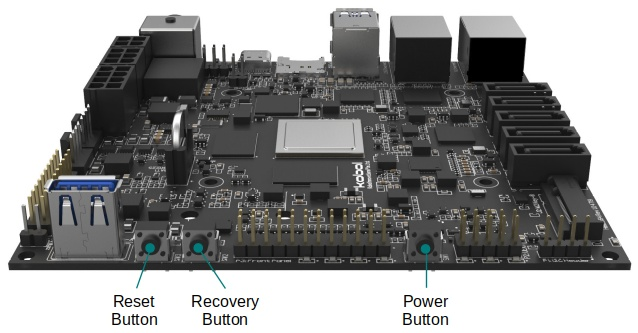

# On-board Button

!!! note
    All the above on-board buttons are also exposed on the [Front Panel](/helios64/front-panel/).

### Power Button

Helios64 board provides a POWER push button (SW1) to power ON/OFF the system. This button is connected to Power Management IC (PMIC) RK808-D. The following actions can be performed:

* **Power ON** : Short press (~1 second) will turn on the system when the current state is power off.
* **Power OFF** : Short press (~1 second) will inform system to perform graceful shutdown when the system is on.
* **Force Power OFF** : Long press (~4 seconds) will signals PMIC to cut off the power in case of system not responding.

### Reset Button

Helios64 board provides a RESET push button (SW3) to hard reset the system.

### Recovery Button

Helios64 board provides a RECOVERY push button (SW2) to allow user to easily flash over USB the on-board eMMC storage. This can be useful if you want to do a fresh install or if you want to repair a system that doesn't boot anymore.

User can enter recovery mode by pressing this button during boot up (bootloader stage). U-Boot will read the button state and switch the USB type-C port into USB Mass Storage device to expose eMMC flash as storage device. User can then use flash tools to write new OS image into eMMC flash.

Under Linux, this button behaves as user button and when pressed will emit **BTN_0** keycode (refer to [Linux Input Codes](https://git.kernel.org/pub/scm/linux/kernel/git/stable/linux.git/plain/include/uapi/linux/input-event-codes.h)). Therefore this button can also be used to trigger other actions than recovery.
