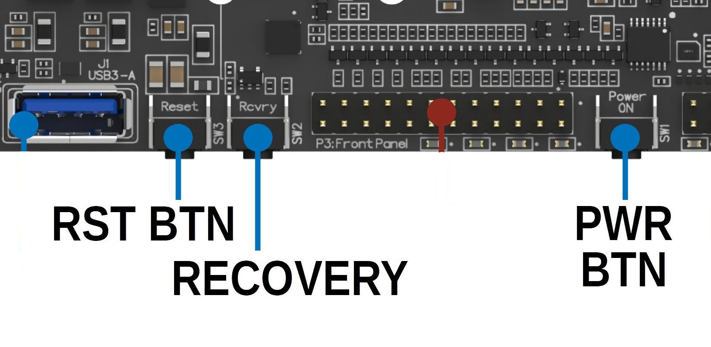

## Onboard Button

### Power Button

Helios64 board provides a POWER push button (PWR BTN) to power on/off the system.
This button is connected to PMIC RK808-D.

Short press (~1 second) will turn on the system when the current state is power off. On Linux, this will inform kernel to perform gracefull shutdown.

Long press (~4 seconds **TBC**) will signals PMIC to cut off the power in case of system not responding (Force power off).

This button also routed to Front Panel, so user don't need to open the case to power on/off the system.

### Reset Button

Helios64 board provides a RESET push button (RST BTN) to hard reset the board.

This button also routed to Front Panel, so user don't need to open the case to hard reset the system.

### Recovery Button

User can enter recovery mode by pressing this button during boot up (bootloader stage). U-Boot will read this button and switch the USB type C into USB Mass Storage device with eMMC as the storage.
User then can use Balena Etcher or dd to write OS image into eMMC.

On Linux, this button behave as user button and when pressed will emit **BTN_0** keycode.

This button also routed to Front Panel, so user don't need to open the case to enter Recovery Mode.

## Front Panel Button

For button location on front panel please refer to [Front Panel](/helios64/front-panel/#the-front-panel-description).

### USR2 Button

There is additional user button on Front Panel board located on [P2](/helios64/front-panel/#wiring-diagram). On Linux, this button when pressed will emit **BTN_1** keycode.

## References
[input-event-codes.h](https://git.kernel.org/pub/scm/linux/kernel/git/stable/linux.git/plain/include/uapi/linux/input-event-codes.h)
