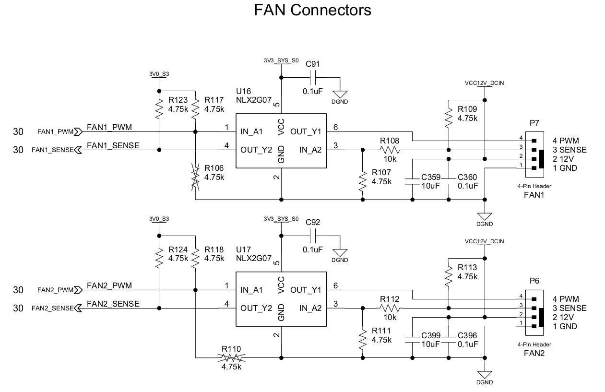

## PWM Introduction

PWM, or pulse width modulation is a technique which allows us to adjust the average value of the voltage that’s going to the electronic device by varying duty cycle of the power at a fast rate.

The term *duty cycle* describes the proportion of 'on' time to the regular interval or 'period' of time; a low duty cycle corresponds to low power, because the power is off for most of the time. Duty cycle is expressed in percent, 100% being fully on. When a digital signal is on half of the time and off the other half of the time, the digital signal has a duty cycle of 50% and resembles a "square" wave. When a digital signal spends more time in the on state than the off state, it has a duty cycle of >50%. When a digital signal spends more time in the off state than the on state, it has a duty cycle of <50%. Here is a pictorial that illustrates these three scenarios:


## PWM Fan Implementation

### Type-A


### Type-B


### Type-C


## PWM Fan Schematic



**Remarks**

| Description | Header P7 | Header P6 | Remarks |
|-----------|---------|-----------|---------|
| PWM pin | PWM0 | PWM1 | 5V tolerant |
| SENSE pin | GPIO4_C5 | GPIO4_C7 | no kernel module/userspace apps that make use of this pin yet  |
| PWM Frequency | 25 kHz | 25 kHz | defined in device tree |

## PWM Fan Connector


Connector Pinout

| Pin | Function | Wire Color |
|-----|----------|------------|
|  1  |    GND   |   Black    |
|  2  |    12V   |   Red      |
|  3  |   Sense  |   Yellow   |
|  4  |  Control |   Blue     |


## Stock Fan


### Fan Specifications

|   Parameter   |  Value   | Unit | Remarks |
|---------------|----------|------|---------|
| Maximum Speed | 3600 | RPM | @ duty cycle 98% |
| Minimum Speed | 350 | RPM | @ duty cycle 10% |
| Shut off | Yes |  | duty cycle  < 6.5% and restart @ duty cycle > 9.5% |
| Implementation | Type-C |  |  |


!!! info
    Duty cycle data is converted from Linux PWM

## Helios64 Temperature Sensors

### SoC Temperature Sensor

RK3399 has internal temperature sensor (TS-ADC) for monitoring die temperature. The system has two Temperature Sensors, channel 0 is for CPU, channel 1 is for GPU.

The sensor has -40~125°C temperature range and 5°C temperature resolution.

### Board Temp Sensor

Helios64 has a **Digital Temperature Sensor with 2‐wire Interface** ([NCT75 Datasheet](https://www.onsemi.com/pub/Collateral/NCT75-D.PDF)), located on top side of the board near RTC battery. It is used to read ambient temperature.

## PWM Fan Control under Linux

Linux uses 8-bit integer to represent duty cycle. PWM value 0 represent 0% duty cycle and PWM value 255 represent 100% duty cycle.


Below graphs is stock fan speed vs pwm value instead of duty cycle.


### Using SYSFS interface

Linux exports the fan control mechanism to SYSFS under hwmon class. List of devices can be checked under _/sys/class/hwmon*

```
ls -l /sys/class/hwmon/
total 0
lrwxrwxrwx 1 root root 0 Oct 16 08:38 hwmon0 -> ../../devices/virtual/thermal/thermal_zone0/hwmon0
lrwxrwxrwx 1 root root 0 Oct 16 08:38 hwmon1 -> ../../devices/virtual/thermal/thermal_zone1/hwmon1
lrwxrwxrwx 1 root root 0 Oct 16 08:38 hwmon2 -> ../../devices/platform/ff120000.i2c/i2c-2/2-004c/hwmon/hwmon2
lrwxrwxrwx 1 root root 0 Oct 16 09:29 hwmon3 -> ../../devices/platform/gpio-charger/power_supply/gpio-charger/hwmon3
lrwxrwxrwx 1 root root 0 Oct 16 09:29 hwmon4 -> ../../devices/platform/p7-fan/hwmon/hwmon4
lrwxrwxrwx 1 root root 0 Oct 16 09:29 hwmon5 -> ../../devices/platform/p6-fan/hwmon/hwmon5
lrwxrwxrwx 1 root root 0 Oct 16 09:29 hwmon6 -> ../../devices/platform/ff3d0000.i2c/i2c-4/4-0022/power_supply/tcpm-source-psy-4-0022/hwmon6
```

!!! info
    The numbering may differ from above example output. It depends on whether the driver built as kernel module or built-in and device initialization order. Take this as consideration when using [fancontrol](#fancontrol-automated-software-based-fan-speed-control)

To identify which hwmon belong to fan, look for *p6-fan* and *p7-fan*. On above example

```
hwmon4 -> ../../devices/platform/p7-fan/hwmon/hwmon4
hwmon5 -> ../../devices/platform/p6-fan/hwmon/hwmon5
```

To read current PWM
```
cat /sys/class/hwmon4/pwm1
cat /sys/class/hwmon5/pwm1
```

To set PWM
```
echo NEW_PWM_VALUE > /sys/class/hwmon4/pwm1
echo NEW_PWM_VALUE > /sys/class/hwmon5/pwm1
```

( *NEW_PWM_VALUE* takes value between 0 and 255 )

### Fancontrol Utility

**fancontrol** software provides automated fan speed control. It is a shell script for use with lm_sensors. It reads its configuration from a file, then calculates fan speeds from temperatures and sets the corresponding PWM outputs to the computed values.

```
sudo apt-get install fancontrol
```

fancontrol includes *pwmconfig* script to create automatically a configuration file but it cannot be used for Helios64.

#### UDEV rules

Since hwmon order can change between kernel version or even between reboot, on Armbian we use udev rules as workaround. The rules can be found [here](https://raw.githubusercontent.com/armbian/build/master/packages/bsp/helios64/90-helios64-hwmon.rules) (mainline) or [here](https://raw.githubusercontent.com/armbian/build/master/packages/bsp/helios64/90-helios64-hwmon-legacy.rules) (legacy kernel 4.4) and need to be copied to **/etc/udev/rules.d/**

*/dev/fan-p6, /dev/fan-p7, /dev/thermal-cpu* and */dev/thermal-board* are symlinks generated by the udev rules.

#### Configuration File

fancontrol uses **/etc/fancontrol** as configuration file. Below is an example configuration to control fan speed on Helios64.

```
# Helios64 PWM Fan Control Configuration
# Temp source : /dev/thermal-cpu
INTERVAL=10
FCTEMPS=/dev/fan-p6/pwm1=/dev/thermal-cpu/temp1_input /dev/fan-p7/pwm1=/dev/thermal-cpu/temp1_input
MINTEMP=/dev/fan-p6/pwm1=40 /dev/fan-p7/pwm1=40
MAXTEMP=/dev/fan-p6/pwm1=80 /dev/fan-p7/pwm1=80
MINSTART=/dev/fan-p6/pwm1=20 /dev/fan-p7/pwm1=20
MINSTOP=/dev/fan-p6/pwm1=29 /dev/fan-p7/pwm1=29
MINPWM=20
```

INTERVAL

This variable defines at which interval in seconds the main loop of fancontrol will be executed.

FCTEMPS

Maps PWM outputs to temperature sensors so fancontrol knows which temperature sensors should be used for calculation of new values for the corresponding PWM outputs.

Fans (**fan-p6** & **fan-p7**) are controlled based on CPU thermal sensor (**thermal-cpu**) reading.

MINSTART

Sets the minimum speed at which the fan begins spinning. You should use a safe value to be sure it works, even when the fan gets old.

Stock fan restart at 15, added 5 for safety (in case of aging fan) give us **20**.

MINSTOP

The minimum speed at which the fan still spins. Use a safe value here, too.

Stock fan stopped at 24, added 5 for safety (in case of aging fan) give us **29**.

-----

*Following settings can be adjusted by user to tweak further.*

MINTEMP

The temperature below which the fan gets switched to minimum speed.

Fans (fan-p6 & fan-p7) runs in minimum speed if the CPU temperature below **40** degree C.

MAXTEMP

The temperature over which the fan gets switched to maximum speed.

Fans (fan-p6 & fan-p7) runs in maximum speed if the CPU temperature above **80** degree C.

MINPWM

The PWM value to use when the temperature is below MINTEMP. Typically, this will be either 0 if it is OK for the fan to plain stop, or the same value as MINSTOP if you don't want the fan to ever stop. If this value isn't defined, it defaults to 0 (stopped fan).

!!! note
    The Helios64 fancontrol configuration file can be found [here](https://github.com/armbian/build/blob/master/packages/bsp/helios64/fancontrol.conf).
